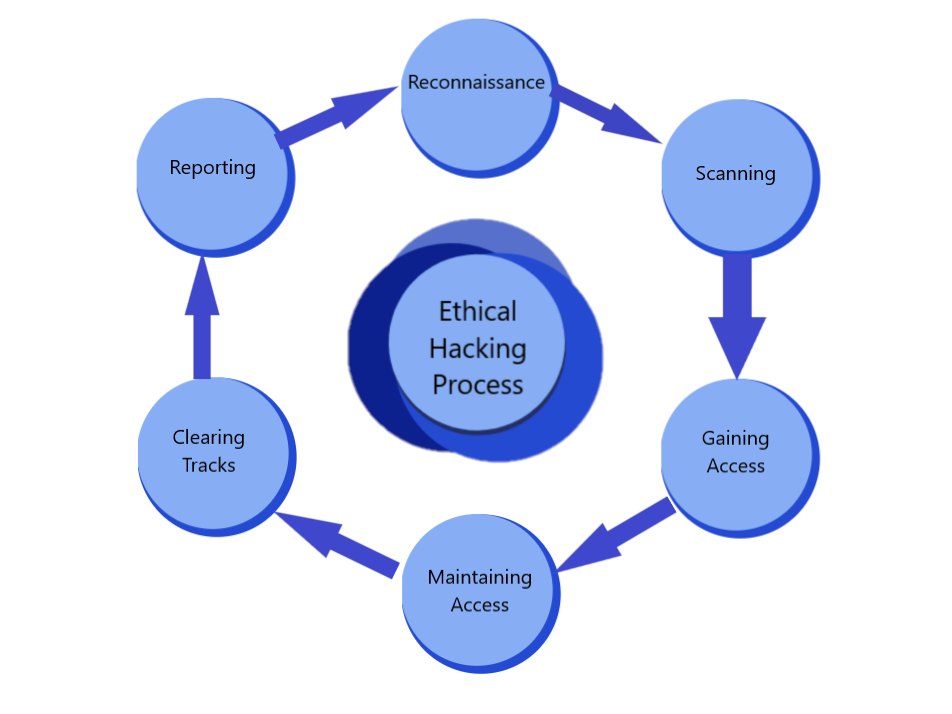

# Ethical Hacking : A Review on Tools,Techniques and Approaches

## Project Description

Hacking, specifically cracking computer systems, is the primary cause of this insecurity. Hacking is a procedure in which an individual or group exploits a system’s flaw for personal gain or enjoyment. Ethical hacking is the technique of breaking into a network with good intentions and in an ethical manner to protect the system from being hacked. For organizations and governments, ethical hacking, also known as penetration testing or intrusion testing, has become a major concern. Companies are concerned about being “hacked”, while potential customers are concerned about keeping control of their personal information.

## Motivation

Despite the fact that internet security is improving, hackers continue to find ways to breach systems. As a result, the need to protect systems from hackers necessitates the promotion of Ethical Hackers, who will fight back against illegal attacks on our computer systems. Ethical hacking is the process of examining security flaws and identifying prospective security vulnerabilities for an organization in charge of the information technology environment under attack. Ethical hackers utilize the same methods to evaluate a security system as their less ethical counterparts, but instead of exploiting flaws, they report them. Ethical hacking and penetration testing are often used interchangeably since they are so closely related. There is, however, a narrow line of distinction between these two terms. Penetration testing is a term that refers to the process of detecting vulnerabilities, dangers, and target environments in order to secure and take control of a system. Ethical hacking, on the other hand, is a broad concept that encompasses all hacking techniques as well as other computer attack strategies. So, in addition to identifying security flaws and vulnerabilities and verifying the target system's security, it goes beyond hacking the system but with authorization to protect the security for future purposes. In general, to carry out tasks, an ethical hacker will need access to each of an organization's systems, whereas a pentester simply needs access to the area of interest.

## Research Questions

 RQ1: Who are Ethical Hacker's and what they do?  
 RQ2: Why do we need Ethical Hackers?  
 RQ3: How Ethical hackers approach towards finding intruders?  
 RQ4: Is Ethical Hacking “Ethical”?  

## Types of Hackers

* **Black Hat** - who hack in order to gain unauthorized access to a system and harm its operations or steal sensitive information.
* **White Hat** -  who never intent to harm a system, rather they try to find out weaknesses in a computer or a network system as a part of penetration testing and vulnerability assessments
* **Grey Hat** - They are a blend of both black hat and white hat hackers.

## Features of Ethical Hacking:
1. Confidentiality  
2. Availability 
3. Integrity 
4. Authentication 
5. Non-Repuditiation

## Ethical Hacking Life-cycle

* **Reconnaissance** -  Information gathering Phase to collect knowledge about systems or people.
* **Scanning** - Scanning is based on pen testing to identify any security or vulnerability gaps that could be exploited to carry out an attack.
* **Gaining Access** - To gain access to the system, once vulnerabilities have been found and all necessary information has been gathered.
* **Maintaining Access** - The system's resources can be exploited by looking for additional common vulnerable devices to maintain access.
* **Clearing Tracks** - The attacker will attempt to erase his traces using tools or erasing the logs.
* **Reporting** - Ethical Hacker creates a report detailing his findings and the work he performed, including the tools he used, the success rate, vulnerabilities discovered, and exploit methods, as well as recommendations.

## Lab Setup / Installation

Softwares required to perfrom Ethical Hacking

* **VMware:** https://www.vmware.com/products/workstation-player/workstation-player-evaluation.html
* **Kali Download:** https://www.offensive-security.com/kali-linux-vm-vmware-virtualbox-image-download/

## Ethical Hacking Tools

**Name**  |  **Description**
----  |  ----
IP lookup |	Allows the identification of the IP in use with a geographical location
MAC lookup |	Allows the identification of the type of the device and the manufacturer
BSSID |	Used to identify a particular BSS (Basic Service Set) within an area based on geographically locating the device in real time
Maltego	| Used to correlate and determine relationships between people, names, phone numbers, email addresses, companies, organizations and social network profiles.
AirCrack-ng |	It works by collecting network packets and then analysing and using them to break Wifi access. It has complete support for 802.11 WEP and WPA-PSK networks It works by capturing network packets and then analysing and using them to crack Wifi access.
Angry IP scanner |	Scans for online IPs and available hosts within a small range, medium range and up to a broadcast range (single or multi IP scan)
Nmap |	Network Mapper used for network discovery along security auditing
Znmap |	GUI Nmap version for network diagnosis
Tracert |	Ensures a network analysis and diagnosis, identifies the track of the sent packet from an IP address to another.
 OSForensics | 	Forensic tool used to delete the log files, audit files and registry files beyond recovery.
Aircrack |	Used for 802.11a/b/g WEP and WPA cracking, used for brute force and dictionary password attacks alike
Wireshark |	Captures real-time network data packets before being displayed in readable.
John The Ripper |	Password cracking penetration testing tool used for dictionary attacks
Metasploit |	Cyber security framework that provides vital information about known security vulnerabilities, ensures penetration testing exploitation strategies, methodologies and plans
Beast |	Remote Administration Tool or a "RAT" horse used to create backdoors

## Ethics in Ethical Hacking

 As per the EC-Council code of ethics, an ethical hacker must ensure
* Before hacking, identify and determine the security and privacy of any organization's data, as well as any rules and regulations that may apply.
* By depending on your creativity and efforts to protect other people's intellectual property, you may ensure that all advantages go to the creator.
* Do not exceed the client's established boundaries when undertaking ethical hacking. It is feasible to have access beyond the target areas that the client signed up for in ethical hacking. Stay within the system or network's target areas as specified in the work agreement.
* Transparency guarantees that the client is aware of what is happening, and that the client can take the required steps to ensure the system's security. Potential threats to any e-commerce clients, the Internet community, or the public that you reasonably suspect are associated with a certain set or kind of electronic transactions, or related software or hardware should be disclosed to authorized persons or authorities.
* Do not share any of the private or confidential information discovered during the hacking with anyone. Ethical hacking is rendered useless when the client's confidential information is revealed.
 
 ## NEWS
 
* [Metasploit](https://www.metasploit.com/)
* [NMAP Security](https://nmap.org/)
* [Apple pays ethical hackers $288k for finding 55 vulnerabilities](https://www.itpro.co.uk/security/ethical-hacking/357380/apple-pays-ethical-hackers-288k-for-finding-55-vulnerabilities)
* [Mobile banking apps are exposing user data to attackers](https://www.itpro.co.uk/security/ethical-hacking/356252/poorly-secured-banking-apps-lead-to-cyber-threats)
* [How do you become an ethical hacker?](https://www.itpro.co.uk/641470/so-you-want-to-be-an-ethical-hacker)
* [The proliferation of hacking as a service is giving cybersecurity experts nightmares](https://economictimes.indiatimes.com/tech/internet/the-proliferation-of-hacking-as-a-service-is-giving-cybersecurity-experts-nightmares/articleshow/76787932.cms)
* [Many BellTroxes: Delhi is now India’s hacker hub](https://economictimes.indiatimes.com/tech/internet/many-belltroxes-delhi-is-now-indias-hacker-hub/articleshow/76304052.cms)
* [India's Ethical Hackers Rewarded Abroad, Ignored at Home](https://gadgets.ndtv.com/internet/features/indias-ethical-hackers-rewarded-abroad-ignored-at-home-1705103)
* [Decade-old Arcadyan Firmware Vulnerability Risks Millions Of Routers Attribution link](https://latesthackingnews.com/2021/08/11/decade-old-arcadyan-firmware-vulnerability-risks-millions-of-routers/)

## Support
For any dounts or information, you can reach me through my mail at nagarajp@lakeheadu.ca

## Acknowledgement
I express my sincere gratitude to Dr. Trevor M. Tomesh for sharing his able guidance and amazing expertise throughout my project.

## Contribute
Contributions are always welcome! Please refer the [contribution guidelines](Contribution_Guidelines.md) file for more information.

## Project Status
My goal is to carry out this project on a larger scale by implementing all the Ethical hacking tools and find the efficient way to use these tools.

## Manifest
**README.md** - The file is the brief description of the survey done with main points.  
**Contribution_Guidelines.md** - Contains contribution guidelines for all pull requests.  
**Ethical-Hacking-Literature-Review.pdf** - Literature review report on Ethical hacking.  
**Ethical_Hacking_Methodology.png** - Image of Ethical hacking phases or life-cycle.  
**Ethical_Hacking_Tools.png** - Image of major Ethical hacking tools and its descriptions.  
**Hacking_Methodology.png** - Image of Hacking phases or methodology.  
**Project-Proposal.pdf** - Contains project proposal details.  
**Final-Research-Report.pdf** - Final Research report on Ethical Hacking: A Review on Tools,Techniques and Approaches.  
**Lab-Journal(Ethical-Hacking).pdf** - Final lab journal which contains different phases of research starting from topic selection to finishing the research.

